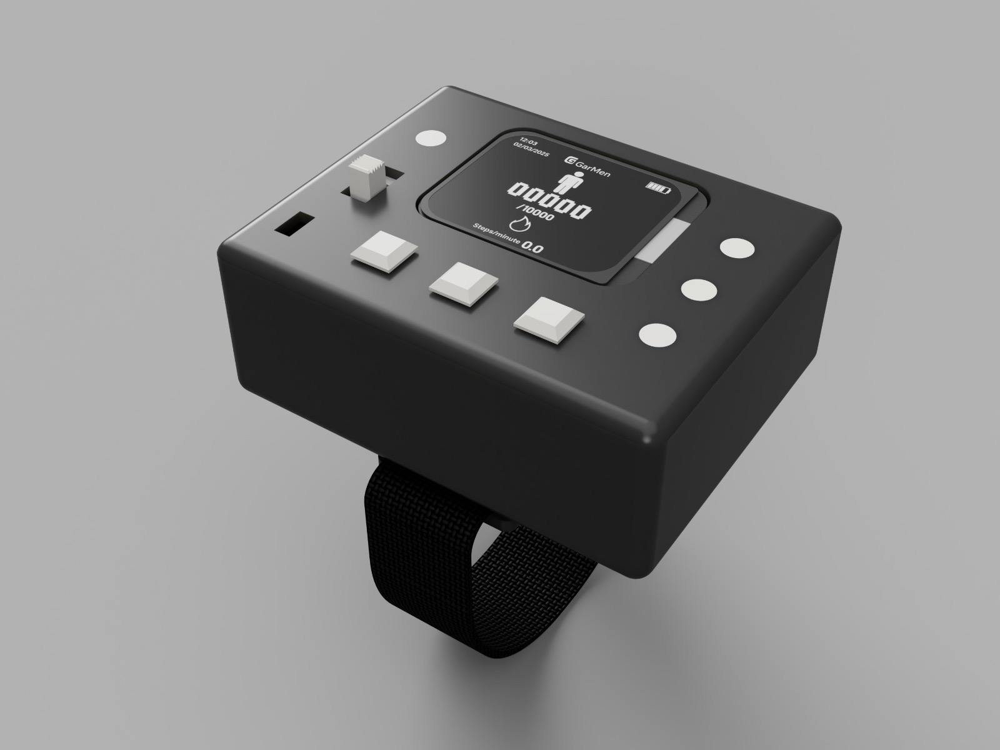

# Step_Tracker_EMS_2025

Code for step tracker for Embedded Mechatronic Systems (Autumn 2025) at UTS.  
Using ESP32S3 Mini and a custom-designed PCB in Altium Designer.
Programmed on C++ in Arduino IDE



---

## 📌 Project Overview

This repository contains the Arduino code, simulation files and MCAD for the **Step Tracker System** using custom designed PCB, featuring ESP32S3 Mini ship and ADXL335 accelerometer.
The system counts steps, identifies walking pace, monitors heart rate and calories, and provides a clean user interface using an LCD screen.

---

## 🚀 Features

- **Step Counting**: Accurate detection using analog acceleration.
- **Pace Detection**: Classifies movement as Idle, Walk, or Run.
- **Heart Rate Monitoring**: Connects to BLE HR sensors (e.g., Polar H10).
- **Calories Burned Calculation**: Uses Zillman formula for accurate kcal estimation.
- **User Interface**:
  - LCD screen with different display modes (Steps / Stats).
  - Bluetooth connectivity status, battery level (optional), and timer.
- **Self-Test Protocol**: Validates ADXL335 using the ST pin.
- **Static Acceleration Calibration**: Calibrates ±X, ±Y, ±Z axes using known gravity values.
- **Dual Power Input**: Runs from DC barrel jack or battery.
- **Signal Conditioning**: Filters analog signals before ADC sampling.
- **BNC Output**: Clean analog Z-axis output for lab validation.

---

## 📦 Required Libraries

Before compiling and uploading, make sure the following Arduino libraries are installed:

| Library | Purpose |
|--------|---------|
| [`Adafruit GFX Library`](https://github.com/adafruit/Adafruit-GFX-Library) | Core graphics support for LCD display |
| [`Adafruit ST7735 and ST7789 Library`](https://github.com/adafruit/Adafruit-ST7735-Library) | Driver for 1.69" TFT LCD |
| [`TFT_eSPI`](https://github.com/Bodmer/TFT_eSPI) | High-performance display driver |
| [`NimBLE-Arduino`](https://github.com/h2zero/NimBLE-Arduino) | Efficient BLE (Bluetooth Low Energy) support for ESP32 |

> 🛠️ **Install these using**:  
> `Arduino IDE → Sketch → Include Library → Manage Libraries`  
> Or manually from GitHub into your `libraries` folder.

---

## 📁 Folder Structure

```text
/Step_Tracker/
│
├── Step_Tracker.ino               # Main Arduino sketch (initializes and runs StepTracker)
│
├── StepTracker.cpp/.h            # Core system controller (coordinates sensors, UI, and states)
├── StepCounter.cpp/.h            # Step detection, step rate, and pace estimation
├── CaloriesCalculator.cpp/.h     # Calorie calculation based on heart rate and step data
├── HeartRateMonitor.cpp/.h       # BLE heart rate monitor interface and data parser
├── ADXL335.cpp/.h                # Accelerometer driver (data reading, calibration, self-test)
├── Clock.cpp/.h                  # Tracks elapsed runtime using millis()
│
├── Button.cpp/.h                 # Debounced button input handler
├── Led.cpp/.h                    # RGB LED control based on pace or test outcomes
├── Lcd.cpp/.h                    # LCD display manager using Adafruit ST7789
├── UserInterface.cpp/.h          # High-level UI controller (button handling, display updates)
├── DisplayState.h                # Enum for UI display modes (Steps, Calibration, SelfTest, etc.)
└── media/                        # Folder for images, fonts, or other display assets
